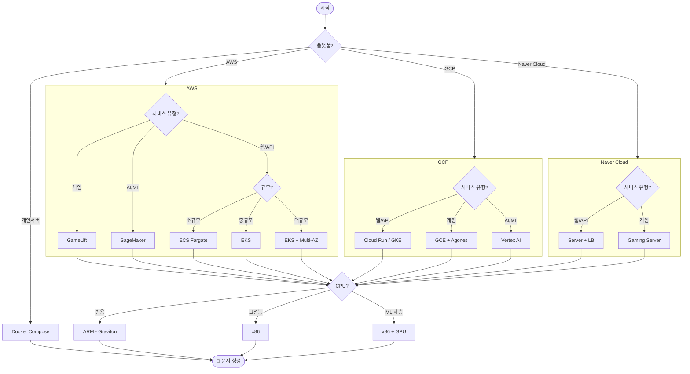
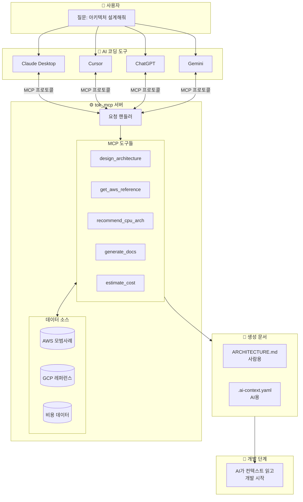
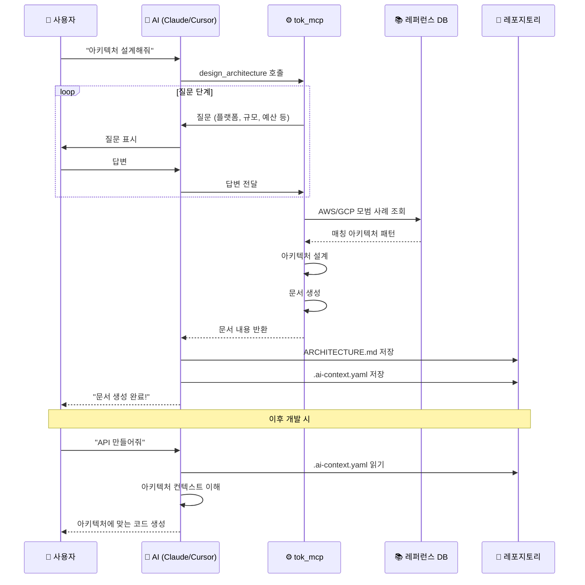
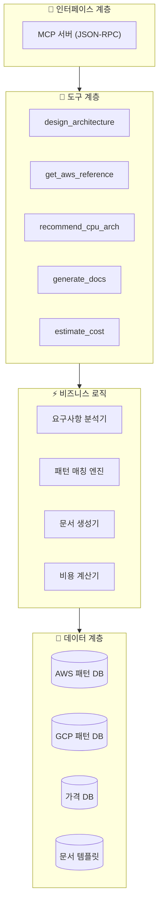
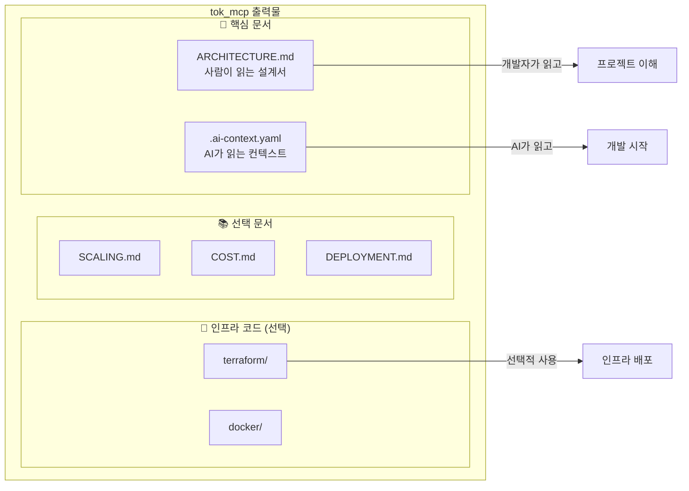

# tok_mcp

> AI 바이브 코더를 위한 아키텍처 설계 전문 MCP

[](https://buymeacoffee.com/tok_coding)

Claude, Cursor, GPT, Gemini 등 AI 코딩 도구 사용자들이 서비스 초기 설계 단계에서 **최적의 아키텍처를 추천**받을 수 있는 MCP(Model Context Protocol) 서버입니다.

## 💡 핵심 원리

**tok_mcp는 직접 환경을 설정하지 않습니다.**

대신, **AI가 인식 가능한 개발 문서**를 레포지토리에 생성합니다.

```
┌─────────────────────────────────────────────────────────────────┐
│  tok_mcp가 하는 일                                              │
├─────────────────────────────────────────────────────────────────┤
│                                                                 │
│  ❌ 직접 서버 설정                                              │
│  ❌ 직접 Docker 실행                                            │
│  ❌ 직접 Terraform 적용                                         │
│                                                                 │
│  ✅ AI가 이해할 수 있는 구조화된 문서 생성                      │
│  ✅ 사람이 읽을 수 있는 아키텍처 설명서 생성                    │
│  ✅ 이후 AI가 이 문서를 읽고 개발 진행                          │
│                                                                 │
└─────────────────────────────────────────────────────────────────┘
```

### 생성되는 핵심 파일 2가지

| 파일 | 대상 | 목적 |
|------|------|------|
| `ARCHITECTURE.md` | 👤 사람 | 아키텍처 설명, 의사결정 이유, 구조 다이어그램 |
| `.ai-context.yaml` | 🤖 AI | 최소 토큰으로 전체 구조 파악, 개발 가이드 |

```
your-project/
├── ARCHITECTURE.md       ← 사람이 읽는 아키텍처 문서
├── .ai-context.yaml      ← AI가 읽는 컨텍스트 파일
└── (이후 AI가 개발 시작)
```

### 왜 이렇게 하나요?

```
일반적인 접근:
  MCP가 직접 설정 → 블랙박스 → 이해 없이 사용 → 문제 발생 시 대응 불가

tok_mcp 접근:
  문서 생성 → AI/사람 모두 이해 → 근거 있는 개발 → 유지보수 가능
```

---

## 📚 목차

1. [초보자를 위한 설명](#-초보자를-위한-설명)
2. [사용법](#-사용법)
3. [설치법](#-설치법)
4. [활용법](#-활용법)
5. [상세 내용](#-상세-내용)
6. [상세 구조](#-상세-구조)

---

## 🔰 초보자를 위한 설명

### MCP가 뭔가요?

**MCP(Model Context Protocol)**는 AI에게 **새로운 능력을 추가해주는 플러그인**입니다.

```
스마트폰 + 카메라앱 = 사진 촬영 가능
    AI   + tok_mcp = 아키텍처 설계 가능
```

### 바이브 코딩이 뭔가요?

AI와 대화하면서 코드를 작성하는 개발 방식입니다.

```
전통적인 개발:
  문서 읽기 → 코드 작성 → 에러 검색 → 수정 → 반복...

바이브 코딩:
  AI에게 "이거 만들어줘" → 완성!
```

### 아키텍처가 뭔가요?

서비스를 구성하는 **서버, 데이터베이스, 네트워크의 설계도**입니다.

```
🏠 집 = 설계도 필요
💻 서비스 = 아키텍처(설계도) 필요

예: 쇼핑몰 아키텍처
┌─────────────────────────────────────────┐
│  사용자 → 웹서버 → API → 데이터베이스   │
│                     ↓                   │
│              이미지 저장소              │
└─────────────────────────────────────────┘
```

### 왜 tok_mcp가 필요한가요?

바이브 코딩은 빠르지만, **처음 설계를 잘못하면** 큰 문제가 됩니다:

| 잘못된 설계 | 결과 |
|------------|------|
| DB 잘못 선택 | 전체 코드 재작성 |
| 서버 크기 잘못 설정 | 요금 폭탄 or 서비스 다운 |
| 확장성 무시 | 사용자 늘면 처음부터 다시 개발 |

**tok_mcp가 해결합니다:**
- ✅ 질문으로 정확한 요구사항 파악
- ✅ AWS/GCP 검증된 모범 사례 적용
- ✅ 예산에 맞는 최적 구성 추천
- ✅ AI와 사람 모두 이해할 수 있는 문서 생성

---

## 🚀 사용법

### 3단계로 끝나는 아키텍처 설계

```
┌─────────────────────────────────────────────────────────────┐
│  STEP 1. 설치 (1분)                                         │
│  ───────────────────                                        │
│  Claude Desktop 또는 Cursor에 tok_mcp 추가                  │
├─────────────────────────────────────────────────────────────┤
│  STEP 2. 질문에 답하기 (3분)                                │
│  ───────────────────                                        │
│  AI: "어떤 서비스인가요?"                                   │
│  나: "회원가입 있는 할일 관리 앱이요"                       │
│                                                             │
│  AI: "예상 사용자는?"                                       │
│  나: "하루 100명 정도?"                                     │
│                                                             │
│  AI: "월 예산은?"                                           │
│  나: "5만원 이내요"                                         │
├─────────────────────────────────────────────────────────────┤
│  STEP 3. 문서 생성                                          │
│  ───────────────────                                        │
│  ✅ 아키텍처 문서 생성 완료!                                │
│                                                             │
│  📄 ARCHITECTURE.md  ← 사람이 읽는 설계 문서               │
│  🤖 .ai-context.yaml ← AI가 읽는 컨텍스트                  │
│                                                             │
│  → 이제 AI에게 "이 컨텍스트대로 API 만들어줘"라고 하면 끝!  │
└─────────────────────────────────────────────────────────────┘
```

### 실제 대화 예시

```
사용자: 아키텍처 설계해줘

tok_mcp: 몇 가지 질문드릴게요.

1. 어떤 플랫폼을 사용하시나요?
   > AWS

2. 어떤 서비스인가요?
   > B2B SaaS, 문서 협업 툴

3. 예상 규모는요?
   > DAU 500명, 동시접속 50명

4. 월 예산은?
   > $100 이내

5. 개발환경 문서도 포함할까요?
   > 네

[문서 생성 중...]

✅ 아키텍처 문서 생성 완료!

생성된 파일:
📄 ARCHITECTURE.md  - 아키텍처 상세 설명 (사람용)
🤖 .ai-context.yaml - AI 컨텍스트 파일 (AI용)

핵심 설계:
- 컴퓨팅: ECS Fargate (ARM64/Graviton)
- 데이터베이스: RDS PostgreSQL (t4g.micro)
- 캐시: ElastiCache Redis
- 저장소: S3 + CloudFront
- 예상 월 비용: ~$75

이제 AI에게 ".ai-context.yaml 참고해서 API 서버 만들어줘"라고 하시면,
AI가 아키텍처를 이해하고 그에 맞게 개발합니다.
```

---

## 📦 설치법

### npm 설치
```bash
npm install -g tok_mcp
```

### Claude Desktop 설정

`claude_desktop_config.json` 파일에 추가:

```json
{
  "mcpServers": {
    "tok_mcp": {
      "command": "npx",
      "args": ["-y", "tok_mcp"]
    }
  }
}
```

**설정 파일 위치:**
- macOS: `~/Library/Application Support/Claude/claude_desktop_config.json`
- Windows: `%APPDATA%\Claude\claude_desktop_config.json`

### Cursor 설정

`.cursor/mcp.json` 파일에 추가:

```json
{
  "mcpServers": {
    "tok_mcp": {
      "command": "npx",
      "args": ["-y", "tok_mcp"]
    }
  }
}
```

### 설치 확인

설치 후 AI에게 물어보세요:
```
"tok_mcp 도구 목록 보여줘"
```

---

## 💡 활용법

### MCP 도구 목록

| 도구 | 설명 | 사용 예시 |
|------|------|----------|
| `design_architecture` | 대화형 아키텍처 설계 | "아키텍처 설계해줘" |
| `get_aws_reference` | AWS 모범 사례 조회 | "SaaS용 AWS 아키텍처 알려줘" |
| `recommend_cpu_arch` | CPU 아키텍처 추천 | "API 서버에 ARM vs x86?" |
| `generate_docs` | 아키텍처 문서 생성 | "문서 만들어줘" |
| `estimate_cost` | 월간 비용 계산 | "이 구성 비용 얼마야?" |
| `get_scaling_strategy` | 확장 전략 제안 | "트래픽 10배 되면?" |

### 생성되는 문서

tok_mcp는 **2가지 핵심 문서**를 생성합니다:

#### 1. ARCHITECTURE.md (사람용)

개발자가 읽고 이해할 수 있는 아키텍처 문서입니다.

```markdown
# 아키텍처 문서

## 개요
B2B SaaS 문서 협업 서비스를 위한 AWS 기반 아키텍처

## 아키텍처 다이어그램
┌─────────────────────────────────────────────────────┐
│                    AWS Cloud                        │
├─────────────────────────────────────────────────────┤
│  Route53 → CloudFront → ALB                         │
│                          ↓                          │
│                   ECS Fargate                       │
│                   (ARM64/Graviton)                  │
│                          ↓                          │
│            ┌─────────────┴─────────────┐           │
│            ↓                           ↓           │
│     RDS PostgreSQL              ElastiCache        │
│     (t4g.micro)                 (Redis)            │
│            ↓                                        │
│           S3                                        │
│     (정적 파일)                                     │
└─────────────────────────────────────────────────────┘

## 설계 결정 사항

### 왜 ECS Fargate인가?
- 소규모 팀에서 Kubernetes 운영 부담 제거
- 서버리스로 운영 비용 최소화
- 오토스케일링 자동 지원

### 왜 ARM(Graviton)인가?
- x86 대비 40% 비용 절감
- 컨테이너 워크로드에 최적화
- 대부분의 언어/프레임워크 지원

### 왜 PostgreSQL인가?
- 복잡한 쿼리 지원 (문서 검색)
- JSON 타입 네이티브 지원
- 확장성 좋음

## 예상 비용
| 서비스 | 사양 | 월 비용 |
|--------|------|---------|
| ECS Fargate | 0.5vCPU, 1GB | ~$15 |
| RDS PostgreSQL | t4g.micro | ~$15 |
| ElastiCache | t4g.micro | ~$12 |
| ALB | - | ~$20 |
| S3 + CloudFront | 50GB | ~$5 |
| **합계** | | **~$67** |

## 확장 전략
1단계 (DAU 1,000): 현재 구성 유지
2단계 (DAU 5,000): ECS 태스크 수 증가, RDS 스케일업
3단계 (DAU 10,000+): Aurora 전환 고려, 캐시 클러스터화
```

#### 2. .ai-context.yaml (AI용)

AI가 최소 토큰으로 전체 구조를 파악할 수 있는 구조화된 파일입니다.

```yaml
# .ai-context.yaml
# AI가 이 파일을 읽으면 프로젝트 아키텍처를 즉시 이해합니다

project:
  name: "my-saas-app"
  type: "b2b-saas"
  description: "문서 협업 서비스"

architecture:
  platform: aws
  region: ap-northeast-2
  style: containerized

compute:
  service: ecs-fargate
  cpu_arch: arm64
  specs:
    cpu: 0.5vCPU
    memory: 1GB
  scaling:
    min: 1
    max: 4
    target_cpu: 70%

database:
  primary:
    type: postgresql
    service: rds
    instance: db.t4g.micro
    storage: 20GB
  cache:
    type: redis
    service: elasticache
    instance: cache.t4g.micro

storage:
  static:
    service: s3
    cdn: cloudfront

networking:
  load_balancer: alb
  dns: route53
  ssl: acm

# AI 개발 가이드라인
dev_guide:
  language: typescript
  framework: fastapi  # 또는 express, nestjs
  orm: prisma  # 또는 sqlalchemy

  structure:
    - "src/api/ - API 엔드포인트"
    - "src/services/ - 비즈니스 로직"
    - "src/repositories/ - 데이터 접근"
    - "src/models/ - 타입 정의"

  env_vars:
    - DATABASE_URL
    - REDIS_URL
    - AWS_REGION
    - AWS_S3_BUCKET

  patterns:
    - "REST API with OpenAPI spec"
    - "Repository pattern for data access"
    - "Structured JSON logging"
    - "Health check endpoint at /health"

  constraints:
    - "ARM64 빌드 필수 (Graviton)"
    - "Connection pooling 사용 (PgBouncer)"
    - "S3 presigned URL로 파일 업로드"

estimated_cost: "$67/month"
```

### 활용 시나리오

#### 시나리오 1: 신규 프로젝트 시작
```
나: "쇼핑몰 만들건데 아키텍처 설계해줘"
AI: (tok_mcp 질문 진행)
AI: "문서 생성 완료! ARCHITECTURE.md와 .ai-context.yaml 만들었어요"
나: ".ai-context.yaml 참고해서 백엔드 API 만들어줘"
AI: (컨텍스트 파일을 읽고 아키텍처에 맞게 개발 시작)
```

#### 시나리오 2: 새 팀원 온보딩
```
새 팀원: "이 프로젝트 구조가 어떻게 되나요?"
AI: (ARCHITECTURE.md 읽음)
AI: "이 프로젝트는 AWS ECS Fargate 기반으로... (상세 설명)"
```

#### 시나리오 3: AI 컨텍스트 공유
```
나: "새 기능 추가해줘"
AI: (.ai-context.yaml 자동 참조)
AI: "현재 아키텍처(ECS Fargate + PostgreSQL)에 맞게 구현하겠습니다"
```

### 문서 구조

```
your-project/
│
├── ARCHITECTURE.md           # 👤 사람이 읽는 아키텍처 문서
│   ├── 개요
│   ├── 아키텍처 다이어그램
│   ├── 설계 결정 사항 (ADR)
│   ├── 예상 비용
│   └── 확장 전략
│
├── .ai-context.yaml          # 🤖 AI가 읽는 컨텍스트 파일
│   ├── 프로젝트 정보
│   ├── 아키텍처 스펙
│   ├── 개발 가이드라인
│   └── 제약사항
│
├── docs/                     # 📚 추가 문서 (선택)
│   ├── SCALING.md           # 확장 가이드
│   ├── COST.md              # 비용 최적화
│   └── DEPLOYMENT.md        # 배포 가이드
│
└── infrastructure/           # 🚀 인프라 코드 (선택)
    ├── terraform/
    └── docker/
```

---

## 📋 상세 내용

### 추천 방식

#### 1. AWS/GCP 모범 사례 기반

검증된 아키텍처 패턴을 기반으로 추천합니다.

**참조 소스:**
- [AWS Well-Architected Framework](https://aws.amazon.com/architecture/well-architected/)
- [AWS Solutions Library](https://aws.amazon.com/solutions/)
- [GCP Reference Architectures](https://cloud.google.com/architecture)
- Naver Cloud 아키텍처 가이드

#### 2. 워크로드 기반 CPU 아키텍처 추천

| 워크로드 | 추천 | 이유 |
|----------|------|------|
| 웹/API 서버 | **ARM (Graviton)** | 비용 40% 절감 |
| ML 추론 | **ARM (Graviton)** | 비용 대비 처리량 우수 |
| ML 학습 | **x86 + GPU** | CUDA 필요 |
| 고성능 컴퓨팅 | **x86** | 단일 스레드 성능 |
| 레거시 앱 | **x86** | 호환성 |
| 컨테이너 | **ARM (Graviton)** | 네이티브 지원, 비용 절감 |

#### 3. 규모별 개발환경 추천

| 규모 | 컨테이너 | 오케스트레이션 | CI/CD |
|------|---------|---------------|-------|
| MVP | Docker Compose | - | GitHub Actions |
| ~1k DAU | Docker | ECS / Cloud Run | GitHub Actions |
| ~10k DAU | Docker | EKS / GKE | ArgoCD |
| 10k+ DAU | Docker | Kubernetes | GitOps |

### 질문 흐름

```mermaid
flowchart LR
    subgraph Step1["STEP 1<br/>기본 정보"]
        S1A[플랫폼]
        S1B[서비스 목적]
        S1C[서비스 설명]
    end

    subgraph Step2["STEP 2<br/>규모"]
        S2A[예상 DAU]
        S2B[동시 접속자]
        S2C[일일 요청 수]
    end

    subgraph Step3["STEP 3<br/>확장성"]
        S3A[성장률]
        S3B[트래픽 패턴]
        S3C[글로벌 여부]
    end

    subgraph Step4["STEP 4<br/>기술 요구사항"]
        S4A[실시간 기능]
        S4B[파일/미디어]
        S4C[AI/ML]
    end

    subgraph Step5["STEP 5<br/>예산"]
        S5A[월 예산]
        S5B[개발환경]
    end

    Step1 --> Step2 --> Step3 --> Step4 --> Step5
    Step5 --> Result([📄 문서 생성])
```



### 아키텍처 추천 의사결정



---

## 🔧 상세 구조

### 전체 흐름도



### 처리 과정 (시퀀스)



### 내부 계층 구조



### 출력 문서 구조



---

## 📍 로드맵

- [x] 기본 아키텍처 추천 시스템
- [x] ARCHITECTURE.md 생성
- [x] .ai-context.yaml 생성
- [ ] AWS Solutions Library 연동
- [ ] Terraform 코드 생성 (선택 옵션)
- [ ] Docker Compose 생성 (선택 옵션)
- [ ] 비용 시뮬레이터
- [ ] GCP/Naver Cloud 지원 확대
- [ ] 아키텍처 다이어그램 이미지 생성

---

## ☕ 톡코딩에게 후원하기

[](https://buymeacoffee.com/tok_coding)

---

## 📄 라이선스

MIT License

---

## 🤝 기여하기

이슈와 PR을 환영합니다!

```bash
git clone https://github.com/seongminjaden/tok_mcp.git
cd tok_mcp
npm install
npm run dev
```
